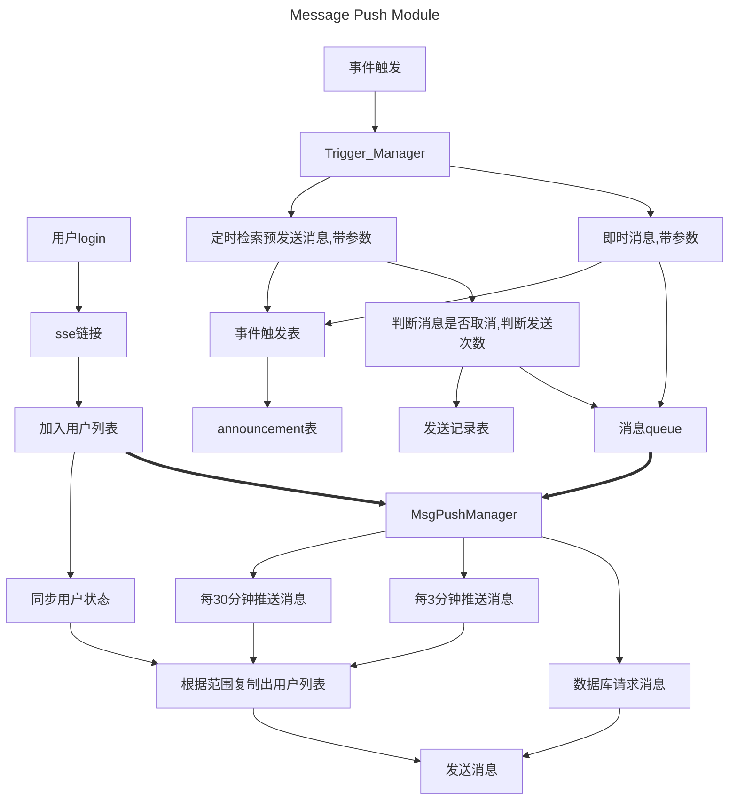
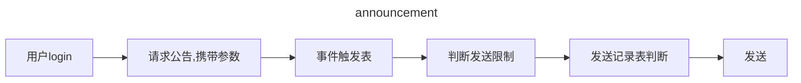
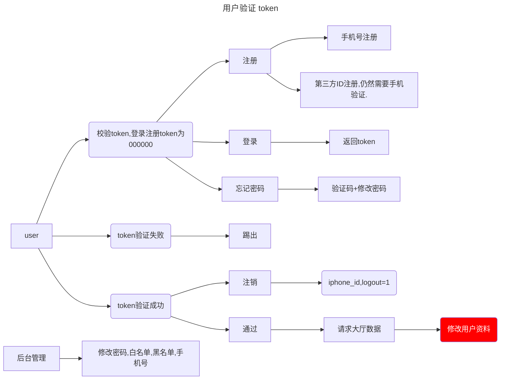
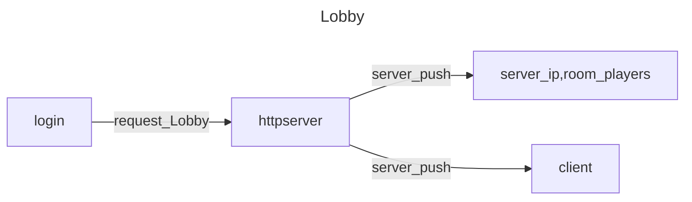

[toc]
hJEMM4AeR__qLQGKR5m58HzW
# framework

## 配置文件

- Nginx
- httpserver
  
  - 登录请求
  - 游戏数据
    
    - 房间数据{房间地址,在线玩家,}
  - 自动匹配
  - 手动匹配
  - 最大连接数
  - 打印日志
  - 下载数据
    - 下载引擎文件
    - 下载配置文件
    - 配置文件csv/json/sqlite
  - 服务器关闭
- mysql
  - mysql.md 配置文件
- sqlite
  -  
- client

## http_server/sql

SQLAlchemy使用sessionmaker对数据库进行操作,可以获得更多的优化配置

### Initialize 

读取配置文件

检测,创建数据库

启动消息管理器

### msg_push

事件触发类型的消息
通过事件监听器,通过消息队列,通知推送管理器推送消息.
通过事件监听器,暴漏函数,被其他模块调用

- 消息入队 ：外部系统通过API将消息添加到队列
- 消息处理 ：后台任务持续处理队列中的消息
- 连接管理 ：跟踪和管理客户端SSE连接
- 消息分发 ：根据消息类型将消息发送给目标用户
- 事件流生成 ：为每个连接生成SSE事件流
- 心跳机制 ：定期发送心跳消息保持连接活跃
- 连接清理 ：定期清理不活跃的连接
- 消息推送类型: 跑马灯 公告

### 公告

触发表

公告表

在线用户表
id,userid,token,ip,lobby,gameserver,room

消息已发表

### 用户行为
- 登录
- 注册
- 第三方接入
- 修改密码
- 注销
- 忘记密码

#### 用户管理
- 修改(白名单,黑名单)

> 日志
- 订单id  请求时间  操作  结果(成功,失败)

### 邮箱系统

用户展示30个,数据库最大存储50个,
插入邮件时判断当前邮件如果邮件数>50个,则按时间排序删除后面29个,加上当前插入的一个.

用户请求邮箱:进入邮箱界面,自动发请求
用户发送邮件:直接插入到用户邮件列表,每天限制发送10个

系统发送邮件:直接插入到用户邮件列表
后台发送邮件:直接插入到用户邮件列表

用户打开邮件,发送消已读消息,标记为以读后领取奖励.

### Lobby

登录后-->请求大厅数据
服务器定时发送大厅数据

- 房间列表
- 在线玩家列表
- 进入房间
- 发送广播

### 房间

- 房间ID
- 房间类型
- 创建时间
- 销毁房间

> 日志
- id  日期时间 房间 {操作  房间id}

### 广播
- 游戏链接 websocket
- 客户端发送服务器
- 服务器发送客户端
  - 系统
  - 用户

> 日志
- id 日期时间 广播 {角色,内容}

### 消息模块

> 路由逻辑
记录请求队列
检查当日有效期,有效,数据.记录数据id

大厅消息每10分钟请求一次.
无限次发送不去已读表检测规则.
去已读表检查已读规则.

已读次数<n 则发送
发送规则,每天n次,每周n次,每月n次,无限次.

> 触发逻辑
发送请求-->(eventID,variables:json)查询触发表
查询eventID,
查询是否有json消息需要拼装,
返回数据
ID,目标,优先级,发送方式,发送时间,消息

> 逻辑
每半小时同步一次消息数据库(不针对个人的消息,未过期的消息,当天的消息) 
每10分钟发送一次消息大厅 
每半分钟发送一次房间消息 
房间即时消息不同步数据库
奖励消息同步数据库.

登录时检索已读消息表的用户ID,
读取消息列表

先发送大厅消息,进入房间后发送房间消息 登录后查询个人消息 同步消息时判断消息是否在有效期.

消息数据库,准备发送的消息(公告,邮件) 邮件针对个人发送,最多记录10个. 公告针对全局发送

发送形式 :即时,延时 类型 :(延时)邮件,公告,聊天(即时),游戏内出发(即时) 目标 :大厅,服务器,房间,组队,个人 发送方式 :一次性,重复 有效期 :

消息队列
消息id,目标,消息类型,起始,结束,优先级,发送时间,过期,消息体

公告内容表

触发设计表

已读记录表

公告表
ID ,创建时间,发送目标,发送方式,启动时间,结束时间,内容{},取消,优先级

发送目标 : 大厅，服务器，房间，组队,个人

定时，触发，

一次性发送,重复发送,每天发送次数

邮件表
userid 邮件内容格式{id,create_datatime,message,is_read,read_time,} 

## 数据库
设计思路:注销的用户在手机号后后缀加4位id,这样可以重复注册.
relationship代码层面的双向关联,方便使用

### 用户表
> user--用户
>- ID 自带雪花算法
>- register_datatime 注册时间
>- phone 手机号
>- password 密码
>- name 用户名
>- email 邮箱
>- ID_Number 身份证号
>- IP 地址
>- logout 注销
>- blacklist 黑名单
>- waiteList 白名单
>- 第三方接入渠道iD{渠道,ID}(未实现)

> online_user--当前在线用户
>- ID uuid
>- datatime 时间
>- ip 地址
>- token 令牌
>- Offline  离线

> room--当前房间
>- ID uuid
>- datatime 时间
>- ip 地址
>- type 房间类型

> game_user
>- ID
>- game_recording{}

> order--订单日志
>- id 日期时间 来源 {消息体}

### 消息表

> 公告表(模板)
ID,创建时间,内容{content:"{key1},{key2}"}

> 触发表(触发)
ID,创建时间,触发事件,公告模板ID,{variables:{key1:"",key2:""}},发送目标,启用时间,结束时间,发送时间,发送方式,优先级,取消
触发事件:登陆,注册,修改密码,修改用户名,在线.
发送目标:大厅,服务器,房间,组队,个人
发送方式:每天一次,每周一次,每月一次,无限次.

> 发送记录表
已读消息数据库(每周/月创建新表) 
ID,userID,触发ID,{类型,读取的date(日期)time(次数)} 类型:每天一次,每周一次,每月一次

> 邮件表
ID,userid { id,message ,create_datatime,,isRead,read_time  }

### 资源表

### 数据分析表

>每日登录用户数
>
>用户操作行为

##  日志

- 行为日志
  - id 创建日期时间 类型 发送类型 发送时间 消息{}
  - 类型:user,serverMessage,gameMessage 
  {id,操作,}
  - user操作:注册 登录 修改密码 退出 注销 
  - serverMessage: 

- 系统日志
  - id 日期时间 {操作}
  - 启动httpserver 启动gamesever   

- 错误日志
  - 客户端指定id打开
  - 服务器自动开启/关闭
  - 模块功能日志,获取上一步模块

> login
>- id 日期时间 来源 {消息体}

## 控制台操作
- 启动
- 关闭
- 日志等级
- 修改数据库

## 反射数据库工具

## 组件
- 打印日志
- 依赖参数传递

